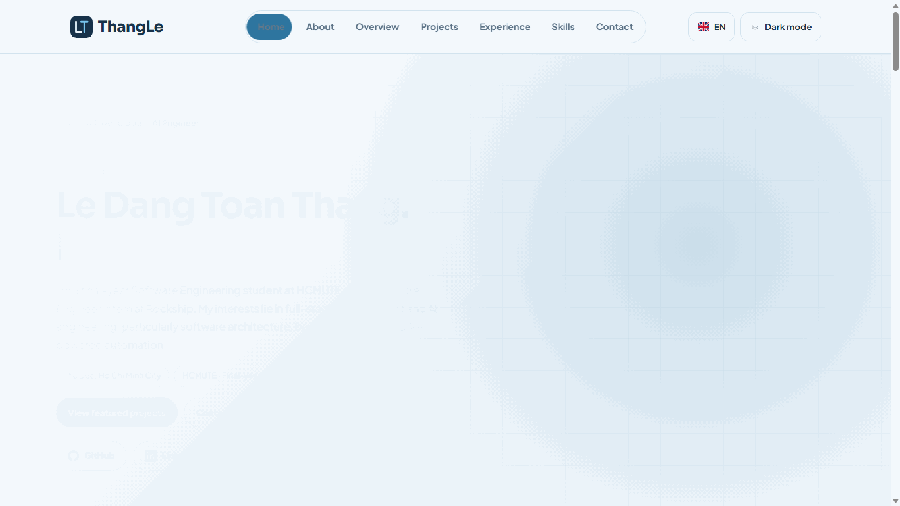

# Le Dang Toan Thang — Portfolio

Personal portfolio website introducing my background, technical skills, internship experience and featured software projects. Each featured project includes a dedicated case-study page with its main technologies, responsibilities and relevant links.

The website is built with HTML, CSS and JavaScript, with GSAP and ScrollTrigger used for motion. It supports responsive layouts, light and dark themes, accessible reduced-motion behavior and a contact form.

---

## 📸 Overview

<p align="center">
  <a href="https://ledangtoanthang.pages.dev/">
    
  </a>
</p>

🔗 **Live site**: [https://ledangtoanthang.pages.dev](https://ledangtoanthang.pages.dev/)

---

## 📑 Table of Contents

- [Overview](#-overview)
- [Personal Information](#personal-information)
- [Tech Stack](#tech-stack)
- [Features](#features)
- [Project Structure](#project-structure)

## Personal Information

- **Name:** Le Dang Toan Thang
- **Role:** Software Engineer · Full-stack Developer
- **Focus:** Backend development, Python automation and AI-powered applications
- **Location:** Thu Duc, Ho Chi Minh City, Vietnam
- **Education:** Software Engineering at Ho Chi Minh City University of Technology and Education (HCMUTE)

## Tech Stack

- **Core:** HTML5, CSS3 and JavaScript
- **Motion:** GSAP and ScrollTrigger
- **Typography:** Plus Jakarta Sans and Sora
- **Contact:** FormSubmit
- **Hosting:** Static-site compatible; production output is generated in `dist/`

## Features

- Responsive single-page portfolio for desktop, tablet and mobile
- Light and dark themes with saved user preference
- Animated role typing and scroll-based content reveals
- Sliding navigation indicator synchronized with the visible section
- Adaptive overview and featured-project grids
- Dedicated case-study pages for featured projects
- Direct social links and click-to-copy contact information
- AJAX contact form with animated success and error states
- Keyboard navigation and reduced-motion support

## Project Structure

```text
PersonalProject/
├── index.html                  # Main portfolio page
├── index.template.html         # Source template assembled at build time
├── package.json                # Production build and README media commands
├── scripts/
│   ├── build-index.js          # Validates and assembles source sections
│   └── generate-readme-gif.cjs # Generates the animated Home preview
├── sections/                   # Reusable page sections and shared footer
│   ├── home.html
│   ├── overview.html
│   ├── projects.html
│   ├── experience.html
│   ├── skills.html
│   ├── contact.html
│   └── footer.html
├── projects/                   # Project case-study pages
│   ├── web-tutor-center.html
│   ├── wedding-service.html
│   └── pharmacy-management.html
├── assets/
│   ├── CSS/
│   │   └── personalStyle.css   # Theme, layouts and components
│   ├── JS/
│   │   ├── theme.js            # Initial theme preference
│   │   ├── theme-toggle.js     # Shared theme interaction
│   │   ├── portfolio.js        # Navigation and interactions
│   │   └── motion.js           # GSAP scroll animations
│   ├── IMG/                    # Portrait and project images
│   └── README/                 # Media displayed in repository documentation
└── dist/                       # Generated production output (not committed)
```
